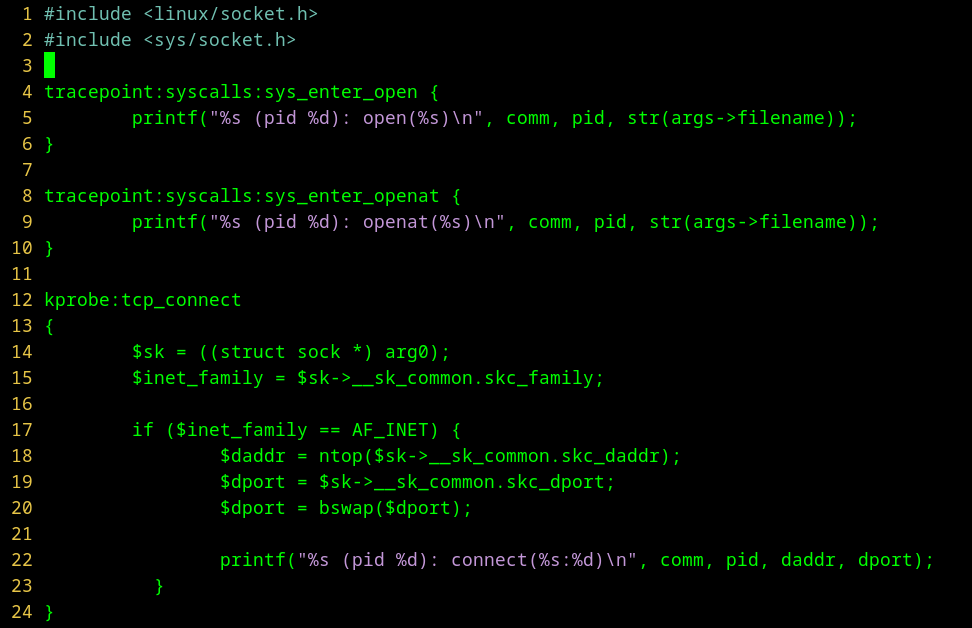
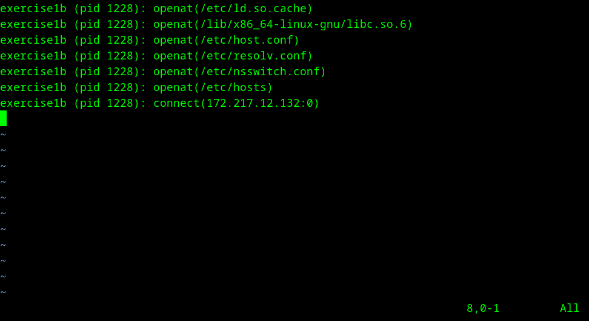

# How To Hide Behavior From Security Tools

## Overview

Thank you for your interest in our AppSec Village POD. In this POD, you will
learn the following:

  - How AppSec behavior monitoring tools work
  - How you can attempt to hide behavior from monitoring tools
  - Types of application behavior that can be hidden, and types that
    generally cannot.
  - As an AppSec professional, how you can configure your monitoring tools
    to ensure application behavior can always be detected.

This POD is sized for approximately 1 hour of hands-on time, following
the tutorial described in this document and is intended for the following
audience:

  - AppSec professionals
  - Application developers
  - Anyone else interested in learning these concepts!

### What Is Covered

Like many security topics, application security, and specifically security
monitoring tools have a very broad surface area for discussion. Although this
POD is sized for a 1 hour exercise, it would be easy to make that 10 hours or
even 100 hours. This POD is intended to cover the basic subject matter;
hopefully you will find the exercises interesting and choose to later embark
upon a self-guided mission to learn more.

Specifically, this POD is broken into several submodules:

  - Understanding core concepts central to behavior monitoring (API
    interception via hooking, external monitoring, etc)
  - Understanding the technical capabilities of various types of behavior
    monitoring tools on Linux
  - Understanding how to use the POD repository / code.
  - Other ideas, and conclusions

### What Is Not Covered

This POD will be focused on behavior monitoring of a variety of simple
applications. The behaviors monitored will be at the syscall and library
level (for example, reading and writing files, making network connections, etc)
and thus will not cover other behaviors such as:

  - XSS/SQLi/SSRF (behaviors that you might find in a web application)
  - Kernel exploits
  - Behavior monitoring and evasion on Windows or other non-Linux platforms
  - This is intended to be a beginner level pod, so anything too crazy or
    advanced won't be covered

### Intended Audience

When building this POD, we wanted to make it appealing to a broad range of
levels of expertise in application development and application security.
That said, there is a certain minimal level of knowledge we think you'll need
to have in order to make this POD useful and enjoyable.

Specifically, this POD is intended for people with the following knowledge
areas:

  - Basic application development concepts (for compiled languages such as C,
    C++, Go, Rust, etc). You don't need to be an expert in all these languages
    but it would be helpful if you understand how things are built, linked,
    and run.
  - Basic knowledge about how system calls and libraries work on Linux. You
    don't need to be an expert here either (we will describe these concepts
    in this POD), but any background you may have will help speed up the POD
    exercises for you.

## Appsec Monitoring Tools Overview

With all that out of the way, let's get started! To set the stage for what
you'll learn in this POD, let's take a few minutes to talk about application
behavior monitoring.

Application behavior monitoring is a way in which a security tool can attempt
to ascertain (guess) if an application is behaving in an expected way. By
examining what an application does, at runtime, a tool can tell the security
team or application developer if the application is exhibiting abnormal
or risky behavior. This monitoring is typically done at some API level; it
could be that the tool is monitoring library calls, or the tool might be
monitoring system calls issued by the application to the kernel.

Regardless of which API level is chosen, how does a monitoring tool even know
what "abnormal" or  "unexpected" behavior is? What library or system calls
constitute "risky" behavior? There are a few ways in which monitoring tools
answer this question:

  - A tool can require monitoring behavior for a period of time to arrive
    at a set of expected behaviors (watching what the application does for
    some period of time, cataloging a list of all the behaviors seen (files
    accessed, network connections made, processes launched, etc)
  - A tool might instead depend on a set of precreated rules that cover a
    large subset of common "bad behaviors" (for example, using weak or
    deprecated APIs, accessing sensitive files, making network connections
    to uncommon destinations, etc)

Both of these approaches have drawbacks. Monitoring application behavior
for a period of time to construct a set of known/expected or approved behavior
runs the risk that you might miss some legitimate behaviors if they were not
noticed during the monitoring period; this can lead to the tool alerting on
or blocking later behaviors that are actually acceptable. Other behaviors
can't really be monitored effectively this way; consider an application that
uses temporary files with randomly generated names. How could a time based
monitoring session account for the possibility that the application may
access a file later whose name (which is random) was not seen?

The second approach benefits from not requiring monitoring of the application
to create the ruleset, but has the drawback that the rules generally need to
be refreshed or updated to reflect new vulnerabilties or attack approaches
carried out by adversaries. Some tool vendors update their rules frequently,
others not as much.

Regardless of which approach is used, monitoring tools are typically governed
by a set of rules (automatically generated or maintained by the tool vendor).
In this POD, we will be looking at how to escape triggering alerts based on
these rules, using a variety of techniques.

### Why organizations use monitoring tools as a defense

Organizations adopt monitoring as a way to answer the question "Is my
application doing the right thing?" Applications may be doing the "wrong
thing" based on a number of reasons:

  - The developer made a mistake and introduced behaviors that are risky
    or unapproved by the organization (unsafe use of memory or other APIs,
    for example)
  - The application depends on a third-party module (or transitively, a
    hierarchy of modules) not under direct control of the organization (OSS
    dependencies are a good example of this), and those modules include
    unwanted behavior (phone home telemetry, malicious code, etc)
  - The application has been compromised, and an attacker is using the
    application as a launching point for further attacks within the
    organization

Many organizations believe that by monitoring what an application does,
they can get in front of these concerns. By monitoring applications during
development and test, risky behaviors introduced by third party dependencies
can be caught. By monitoring applications during production deployment,
unwanted behaviors seen can be indicators of compromise.

### Why are we learning about evading these tools?

As a defender, understanding how an attacker evades monitoring can help you
more properly harden your tool environment and create rules that are more
difficult for attackers to hide from.

As an attacker, learning the default way in which these tools are often times
deployed can assist you in finding targets that are easier to attack. Further,
understanding how these tools intercept behavior can possibly help you create
new types of exploits that tool vendors may not be able to see. Further, if
you are able to evade detection by these tools, you may be more easily able
to cover your tracks during an exploit.

## Technologies used by monitoring tools

Monitoring tools watch the application by monitoring which APIs are used. Of
course, the term "API" could mean a lot of different things; common tools will
usually monitor at either the system call level or at the libc/library level.

Monitoring system call invocations made by an application can be accomplished
by a variety of means:

  - Using an eBPF program (Extended Berkeley Packet Filter) in the kernel
    to receive notification when a monitored process invokes a syscall
    the tool is interested in
  - Using external monitoring (ptrace, ktrace, strace, etc)

Monitoring library calls can be accomplished by injecting code into a process
and hooking functions, or by using LD\_PRELOAD to override symbol resolution
when the application is launched.

In this POD, we will focus on eBPF and LD\_PRELOAD based tools, and we'll
explain how each works in detail in the exercise subsections later. Don't
worry if you don't know what those terms mean yet.

## Building the POD code

To build the POD code, we've provided two Makefiles (one in src/exercise1 and
another in src/exercise2). Just clone this repo and run "make" in the examples
directories. The POD depends on the following packages, which might
need to be installed in your environment:

  - make
  - gcc
  - bpftrace

Once you've built the exercises, the rest of the instructions here are the same.

## The exercises

This POD is broken down into three exercises. The exercises are:

  - *Evading syscall monitoring tools*
  - *Evading library API monitoring tools*
  - *Evasion by syscall avoidance*

## Evading syscall monitoring

In this example, you will learn how eBPF system call monitoring tools work, and
a few things you can try to perform certain actions without being noticed
by the tool. For this example, we will use a contrived eBPF tool, one that
is configurable to monitor certain system calls.

### What is eBPF and how does it work?

eBPF, the Extended Berkeley Packet Filter, sounds like a technology best used in
a network firewall, based on its name. And indeed, eBPF is based on a previous
technology (BPF, now called cBPF) that was originally made to handle network
packet filtering in the kernel. Over time, capabilities were added to BPF,
turning it into a more generic monitoring framework, now capable of monitoring
a multitude of events (system call monitoring being one of these types of
events).

eBPF programs are written in BPF bytecode, compiled, and subsequently loaded
into the kernel. As loading arbitrary unverified code into the kernel is
dangerous, the eBPF subsystem attempts to validate all eBPF bytecode before
loading to ensure it won't crash the kernel.

Since an eBPF program runs inside the kernel, they are typically paired with
a usermode daemon program that collects and logs what the eBPF program sees.
This information can be presented to the system administrator or appsec team
for further review.

When an eBPF monitoring program is made, the designer typically will register
hooks for specific system calls of interest. As you will see in this example,
this may mean that new system calls added to the kernel after the eBPF program
was developed will usually require upgrading the eBPF part of the monitoring
tool to capture the new system calls. Also worth noting is that Linux contains
different syscalls that can be used to accomplish the same thing (for example,
opening a file), and unless the tool is configured to monitor all of them,
an attacker can use an unmonitored variety to escape detection.

### Understanding what system calls are being monitored

Commercial security tools that use eBPF to monitor system calls are generally
configured using configuration files that describe what types of events are of
interest to the user of the tool. While it's not always generally the case that
the configuration file simply lists out a list of available system calls,
tools generally have groups of behaviors that can be enabled or disabled,
directing the tool to intercept groups of system calls that relate to the
selected behaviors.

When selecting which system call to use to evade monitoring, what can you
rely on? One thing that is sometimes useful is to use new system calls; we'll
show an example using this technique in exercise 1b below.

### Exercise: Evading eBPF system call monitoring

This exercise's content lives under the /home/user/exercise1 directory and
consists of the following:

  - An eBPF program you will load into the kernel that monitors various
    system calls
  - An example application designed to illustrate how the eBPF program works
    + This program accesses files in /etc, and makes a few outbound network
      connections (things that would typically be of interest to a security
      monitoring tool)

To run this example, issue the following command to start the eBPF monitoring
program:

  - As root, run /home/user/exercise1/monitor

Next, in another window, issue the following command to run the example/test
application:

  - /home/user/exercise1/exercise1a

The eBPF monitoring program will log its observations to /tmp/exercise1.log
and will contain information about the system calls observed. Since we are
monitoring using eBPF, all system calls from all processes will be logged
(including those from processes other than exercise1a).


#### Advanced: Looking at the code

If you're interested in how the eBPF monitoring code and example application
works, read on. Otherwise, you can skip this section.

As shown below, the eBPF monitoring code contained in exercise1.ebpf is
installed in the kernel using the `bpftrace` tool. This tool is used to load a
high level version of the eBPF byetcode into the kernel (raw BPF/eBPF language
is more low level than what you're seeing here). The code is configured to
monitor three kernel activities:

  - _open_ system calls
  - _openat_ system calls
  - _Outbound TCP connections_



On each interception, information about the process performing the operation
is printed (lines 5, 9, and 22). The bpftrace program will stay in the
foreground until killed with ^C.

The [exercise1a.c](src/exercise1/exercise1a.c) file contains the sample
application; it is a contrived example of an application that performs the
following:

  - Opens /etc/shadow
  - Performs a DNS resolution of www.google.com
  - Connects to the address returned from the DNS resolution

It should be apparent how the operations listed above match the monitored
activities in the previous list.

### Evading system call monitoring

If we wanted to hide some of the behavior exhibited by exercise1a, what could
we do? There are several things we can try:

  - Avoid the system calls being monitored (eg, try to use a variant not
    monitored)
  - For file operations, we can try and avoid I/O related system calls
    altogether

For the purposes of this exercise, we will concentrate on trying to still run
our example applications and avoid monitoring; techniques involving unloading
or disabling the monitoring tool will not be discussed.

If you examine /tmp/exercise1.log, you'll see that the monitoring tool was
able to see our example application's use of the _open_ system call. However,
there are many system calls that open file descriptors that we may be able to
substitute (if the monitoring tool, for example, is not choosing to intercept
those calls). For example:

  - openat
  - openat2
  - open\_by\_handle\_at
  - open\_tree

Some of these system calls are fairly new, and may not be known by monitoring
tools. Others are uncommon, and may also not be monitored for similar reasons.
For example, open\_by\_handle\_at would require the monitoring tool to track
all open file handles for every application, and dereference each file handle
seen on every invocation of that syscall.

In the /home/user/exercise1 directory, you'll find another executable named
exercise1b. This executable replaces _open_ calls with _openat2_ calls, and
avoids having its file operations seen by the monitoring tool (this can be
verified by reviewing the monitoring log after running example1b). You should
see that the _open_ operation for /etc/shadow is not seen (you can compare
the two log outputs to verify this, one from exercise1a and the other from
exercise1b).



#### Advanced: Looking at the code

If you examine the exercise1b.c code, you'll see that the call to _open_
has been replaced by a hand-rolled system call invocation of _openat2_. This
is our attempt to hide the opening of /etc/shadow by using a system call
not monitored by the eBPF script.

If you wanted to experiment, you could duplicate the code block in
exercise1.ebpf and add a block for _openat2_ as follows:

```
tracepoint:syscalls:sys_enter_openat2 {
     printf("%s (pid %d): openat2(%s)\n", comm, pid, str(args->filename));
}
```

If you then re-run exercise1b, you'll see that the openat2 system call is
indeed monitored.

### Lessons learned

In this lesson, you learned:

  - How eBPF monitors system calls in the kernel
  - How you can potentially identify which system calls are being monitored
  - Ideas for hiding file modification behaviors

## Evading library API monitoring

In this next example, you will learn how LD\_PRELOAD interception techniques
work, and a few things you can try to perform certain actions without being
noticed by this form of monitoring. For this example, we will use a contrived
LD\_PRELOAD library containing a few intercepts.

In order to understand what LD\_PRELOAD is, and what behaviors it can monitor,
we should take a few minutes and talk a bit about how executables are built and
subsequently loaded by the kernel.

When an application is linked, the linker will make a list of any external
dependencies needed by the executable, and place this list into the executable
along with the list of libraries used during the link phase. For _dynamic
linked_ executables like this, the operating system will typically make
use of _ld.so_, which is called the runtime loader (or runtime linker, compared
to the compile time linker _ld_ used during build) to assist with the loading
of the executable.

The operating system will use the loader defined in the application (ld.so, for
example) to assist in loading and resolving any dependent symbols in the
executable. For example, if a symbol named _open_ is required by the application
but not present in the binary, the loader (ld.so) will load each of the
libraries listed in the application and attempt to locate a symbol with a
matching name. If a symbol with a matching name is found in a library loaded by
ld.so, the loader will ensure that when the application calls _open_, the
call is routed to the implementation found in the library.

LD\_PRELOAD is an environment variable that influences the behavior of the
loader. Specifically, it instructs the loader to prefer symbols contained in
libraries that it points to _first_, allowing those libraries' implementations
of things like _open_ to take precedence over those found in other (typically
system) libraries. For example, if LD\_PRELOAD was set to "foo.so", and foo.so
contained an _open_ symbol, then any calls to that function would go to foo.so
and not to libc (which is typically where you will find that function).

This means that the implementation of _open_ contained in foo.so is responsible
for actually _doing_ the open (otherwise that application's opening of files
would never work). This is usually done by having the replacement _open_ call
the original _open_ after doing any of its own processing (the location of
the original _open_ can be found by using _dlopen_ and _dlsym_, if you're
curious how this is done).

Since the replacement _open_ gets called first, a monitoring tool can use this
fact to insert additional checks (logging, behavior modification/rejection,
etc). Provided that LD\_PRELOAD is automatically set (either globally or on
each _exec_, the library/API interposition can be carried forward to child
processes arbitrarily.

LD\_PRELOAD libraries can generally interpose on any API that is subject to
symbol resolution when the application is loaded. This means things like
file operations (_open_, _close_, etc), socket operations (_listen_, _connect_,
_bind_, etc) and process related operations (_fork_, _exec_, etc) can all
be monitored. However, the LD\_PRELOAD technique is not without drawbacks:

  - As LD\_PRELOAD works in conjunction with the runtime loader, things that
    don't use a loader won't respect LD\_PRELOAD (for example, statically
    linked executables).
  - Certain scenarios intentionally ignore LD\_PRELOAD. These include setuid or
    setgid programs, or any executables that have extended capabilities set.

### Understanding what APIs are being monitored

If a library such as foo.so is being inserted via LD\_PRELOAD, you can learn
which symbols it is overriding by using the 'nm' command:

### Exercise: Evading the monitoring library

In this exercise, we will use a contrived monitoring library located in
the /home/user directory (libexercise2.so). This library mimics what a security
monitoring tool might do:

  - It overrides _open_, and logs any attempt to open files in /etc
  - It overrides _connect_, and logs all outbound connection attempts that
    use TCP/IPv4.
  - It overrides _gethostbyname_, and logs all host resolution requests that
    use that API.

The exercise2.so library is configured to log these behaviors to
/tmp/exercise2.log.

To run this exercise, issue the following commands (assuming /home/user is
where you installed the code):

  * export LD\_PRELOAD=/home/user/exercise2/libexercise2.so
  * /home/user/exercise2/exercise2a

The first command sets the LD\_PRELOAD environment variable to the monitoring
library, while the second command runs a test program that is setup to perform
a few of the API calls described above. After you run the test program, you
can issue the following command to remove the LD\_PRELOAD behavior:

  * unset LD\_PRELOAD

After running the test program, you can examine /tmp/exercise2.log to see what
behaviors the monitoring library was able to see.


If you have control of an application's execution environment, you can hide
from monitoring by:

  - Trying to disable LD\_PRELOAD altogether
  - Using different call sequences to avoid calling any of the monitored
    function

In the /home/user/exercise2 directory, you'll find a second test program
called exercise2b, along with its source code (exercise2b.c). This variety
of the exercise uses hand-rolled/hand-coded system call invocation code for
the _open_ api, but otherwise still performs the same actions as exercise2a.

Run the exercise2b code by:

  * export LD\_PRELOAD=/home/user/exercise2/libexercise2.so
  * /home/user/exercise2/exercise2b

You'll find that during exercise2b, the monitoring library was unable to
monitor any of the _open_ API calls; this is because exercise2b does not call
_open_ anymore; instead, it uses a hand-made variety of _open_ that calls
the underlying system call directly (much like libc's version of _open_ does).
You can see the code that does this in exercise2b.c .

Next, you can try to disable loading of the libexercise2.so library altogether.
Here are two commands you can try:

  - setcap cap\_mknod=eip /home/user/exercise2/exercise2a
    + This needs to be run as root. It adds a dummy capability to the
      executable, which causes the loader to ignore LD\_PRELOAD entirely.
    + setcap -r /home/user/exercise2/exercise2a can be used to remove the
      capability added (and should be done before proceeding to the next
      command.
  - chmod 4755 /home/user/exercise2/exercise2a ;
    chown root /home/user/exercise2/exercise2a
    + This makes the exercise2a executable setuid root. Setuid executables
      also cause the loader to not honor LD_PRELOAD.

You might be thinking "I needed to be root to do these things. If I'm root,
aren't all bets off? Can't I just delete or otherwise remove the monitoring
software?" This is certainly a valid observation. However, if your goal is
to evade the monitoring software, that's not really the same as removing
it entirely. A lack of all monitoring telemetry (which is would would happen
if you removed the monitoring software entirely) might raise other alarms.

There are likely many other ways to evade monitoring if you do have root
access; the two examples above are provided to illustrate specific ways
in which the loader can be influenced to ignore LD\_PRELOAD, which is the
focus of this exercise.

### Things to consider

You might be tempted to try and unset LD\_PRELOAD from within an application,
in an attempt to avoid monitoring. However, unsetting LD\_PRELOAD after the
application is loaded does not affect the currently running application since
the loader has already configured the application to use the monitoring
library during program start. Depending on whether or not the monitoring
library resets LD\_PRELOAD during child program launching, clearing LD\_PRELOAD
may allow for children processes to be excluded (libexercise2.so does not do
this).

### Lessons learned

In this lesson, you learned:

  - How the linker and loader work with LD\_PRELOAD
  - The types of APIs you can expect monitoring tools to be able to monitor
    using LD\_PRELOAD
  - An example of an LD\_PRELOAD based monitoring library
  - Ideas to avoid being seen by monitoring tools using this type of technology

## Avoiding read detection via io\_uring

io\_uring is a new Linux subsystem designed to provide fast I/O by not
having to suffer from the system call overhead associated with repeated
I/O system calls (read, write, etc). It accomplishes this by using a zero-copy
approach wherein the kernel deposits read results (or fetches write requests)
from a shared ring buffer in userspace.

Another, simpler way to describe this is as follows:

  - The user process opens a file for reading.
  - Instead of issuing system calls like read(), pread(), etc, the process
    instead sets up a list of buffers into which it tells the kernel
    "please read the file into these buffers, and signal me when some buffers
    are ready for processing". This is not unlike pread()/preadv2()
  - The user mode process acts on the content of the buffers and advance
    a _ring pointer_, telling the kernel that "n buffers have been consumed,
    please process the next n buffers".
  - This process continues until the I/O operation is complete.

The difference between pread/preadv2 and io\_uring is that in the io\_uring
case, the process does not need to make multiple system calls to process the
next buffers in the ring. Instead, a head/tail index mechanism is used; the
only "overhead" associated with requesting the next n buffers is updating
a single value in memory. This avoids all the system call overhead (context
switches, spectre/meltdown overhead, etc) and greatly improves I/O performance.

In this repository, there is an exercise3 application that utilizes io\_uring
to perform file reads without actually calling any read()-family system calls.

To run exercise3:

  - As root, run /home/user/exercise3/monitor

Next, in another window, issue the following command to show that the monitor
tool captures reads:

  - cat /etc/passwd      (or any other file of your choice)

Next, in another window, issue the following command to run the example/test
application:

  - /home/user/exercise3/exercise3 /etc/passwd     (or any other file of your
    choice)

Because exercise3 uses io\_uring to perform the read operation, you should
not see any read output from the monitoring tool for the file you requested.
There is one single read() captured (this is the loader reading shared libraries

into memory and not the file you actually accessed in the example, though).
Also note that the initial open of the file is still captured by the monitor,
so it's not a perfect evasion.

## Miscellaneous topics

In this section, we'll cover a few topics that are related to this POD, but
didn't fit well in other sections.

### Confused deputies

A confused deputy is a process that can be convinced to perform an action
that it usually does not perform (for example, accessing a file or making
a network connection). Using a confused deputy is a way you may be able to
evade detection by a monitoring tool, especially if the tool is configured
to either not monitor every process running on the machine, or to ignore
the confused deputy process.

When using a confused deputy, typically you will take advantage of actions
that the normally deputy does, but may be externally configurable by you. For
example, consider a program that accesses a configuration file specified by
a command line parameter and performs operations based upon the content of
that file, or performs operations based upon other command line parameters. If
you could somehow run that confused deputy process with arguments of your
choosing, you may be able to perform actions outside the purview of the
monitoring tool (if the deputy process is whitelisted and not monitored,
for example).

Let's say we wanted to use a confused deputy to perform a data exfiltration
using DNS lookups (eg, a DGA attack). What application might be running on
a typical Linux machine that we might use in order to issue a DNS lookup that
might not fall under the purveyance or monitoring of a security tool?

If we rolled our own DNS client, or spawned dig or nslookup, the monitoring
tool might detect us using send() or recv() to/from an unexpected address,
or calling exec\*() to launch dig or nslookup. If we commandeered control of an
application that did not generally use these APIs, we might
raise an alert. We need to be able to hide in normal traffic, behaving like
a normal application. Usually, connections to localhost aren't subject to
alerts by monitoring tools (since these types of connections tend to occur
frequently and generate a lot of noise and false positives). What could we
connect to running on the same machine that we could use as a DNS proxy?

Consider systemd-resolved. This is a resolver that runs on most Linux
machines and implements a forwarding and caching local DNS server. Since
all nameserver lookups will generally flow through this daemon, it is likely
not something being monitored. Further, even if it was monitored, the
monitoring tool would only end up seeing a stream of outbound DNS lookups,
without any of correlating which request came from which process (this
information would be "hidden" from view since all queries appear to originate
from systemd-resolvd, not the actual application).

If we created a TCP connection on port 53 to 127.0.0.53 (the aliased loopback
address used by systemd-resolved), we could issue our DNS (DGA) request in a
way that would simply look like a connect() call to any tool monitoring us.
Since we would be bypassing any gethostbyname() family libc calls, we wouldn't
likely be flagged by LD\_PRELOAD based monitoring, either.

### Some questions to ponder

  - Why wasn't the DNS resolution operation caught by the eBPF monitor?
    + Could you add a monitoring stub to the eBPF program to capture
      _getaddrinfo_ ?
  - In exercise 2b, why did we not replace getaddrinfo with s\_getaddrinfo?
  - Look at LD\_AUDIT, another environment variable affecting the operation
    of the loader. Could LD\_AUDIT be used to circumvent LD\_PRELOAD?

## Conclusion

We hope you've had a fun time working through the exercises in this POD, and
have learned about appsec monitoring tools and the technologies they use.
We also hope we've been able to give you some ideas about how these tools
can be circumvented in certain situations and that you will use this knowledge
to further secure any environments you are responsible for.

At Deepfactor, we provide an application security tool that gives usage based
correlation for vulnerabilities. We provide the ability for developers and
appsec teams to determine remediation prioritization based on what code
the application actually uses. This means you don't need to worry about
hundreds of CVEs that you may see displayed in your SCA/SBOM tool's output.
If this sounds like something you'd be interested in, we invite you to
visit us at [https://www.deepfactor.io](https://www.deepfactor.io) for more
information. If you'd like to learn more about API interception, check out
[this whitepaper](https://www.deepfactor.io/observing-application-behavior-via-api-interception/).


Happy hacking!
